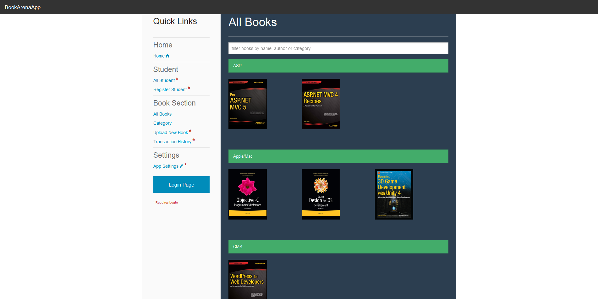
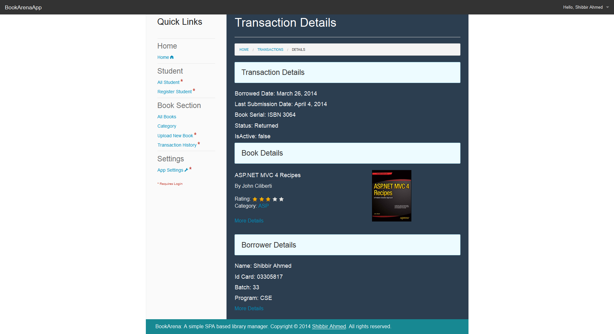

import Gallery from "../../components/gallery"

BookArena is a simple responsive <a href="https://en.wikipedia.org/wiki/Single-page_application">SPA</a> based library manager built with asp.net web api and angularJS. It also uses Microsoft’s new membership implementation called Identity to facilitate <a href="https://en.wikipedia.org/wiki/Access_control_list">ACL</a> in the application.

GitHub: [https://github.com/shibbir/bookarena](https://github.com/shibbir/bookarena)

### Built with

- [AngularJS](https://angularjs.org/)
- [ASP.NET Web API](https://www.asp.net/web-api)
- [ASP.NET Identity](https://www.asp.net/identity)
- [AutoMapper](http://automapper.org/)
- [Entity Framework](https://www.asp.net/entity-framework)
- [Foundation](http://foundation.zurb.com/")
- [Toastr](http://codeseven.github.io/toastr/)
- [MorrisJS](http://morrisjs.github.io/morris.js)

### Screen shots of the app

<Gallery images={[
    {src: "./images/login.png"},
    {src: "./images/dashboard.png"}
]}/>
