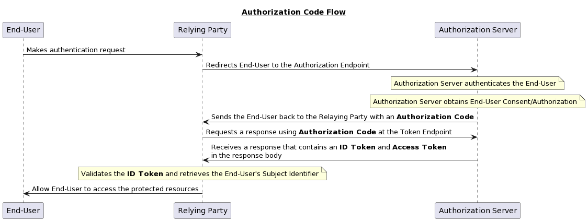
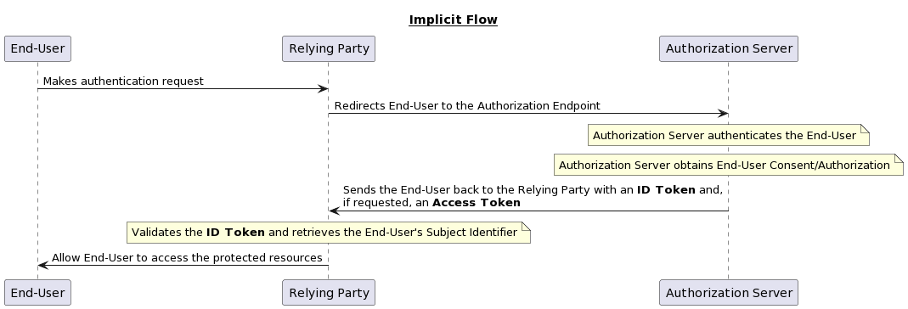
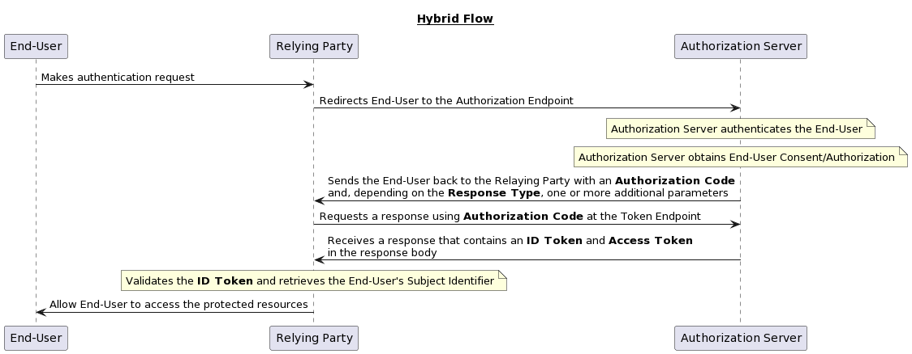

Authenticating and authorizing users to grant them access to the protected resources is one of the basic features of any application whether it's a web-based or mobile application. In the beginning, **SAML(Security Assertion Markup Language)** was created as a replacement for passwords for exchanging authentication and authorization data between parties. One of the main drawbacks was the use of XML, making this approach very verbose and heavy. It is mostly used in the corporate environments. Another protocol that was gaining more popularity because of its more consumer-friendly nature, is **OAuth(Open Authorization)**, which is mainly used for authorization. After that **OpenID Connect** was created for authentication, which is an identity layer on top of the OAuth protocol. In this article, we are mainly interested in the authentication of an entity and how OpenID Connect helps us achieve that.

## Authentication vs Authorization

These terms may confuse lots of developers out there and they are also often used interchangeably. It is very crucial to understand the difference between the two because our selection of tools to properly manage user identity depends on it.

[Authentication](https://en.wikipedia.org/wiki/Authentication) is an act or process of identifying or confirming the identity of an entity(machine, user, etc.). For example, when entering your office, you might need to use your employee id card to unlock the electronic door before entering the building. How this identification should happen depends on who is identifying. In this case, it is the company that builds the door lock that is verifying exactly who is the user that trying to access the building.

[Authorization](https://en.wikipedia.org/wiki/Authorization) is an act or process of verifying the rights or allowed actions of an entity. For example, when you buy a ticket for a show. The ticket contains no identification about you, all it's saying is that you have the right to watch that show.

It is important to notice that authentication sometimes can lead to authorization but that the opposite is not true. In the above example of people unlocking the door with the employee id card, it is possible that you can enter the door with someone else’s id card. In this case, the door locking mechanism performs **Authentication** of the id card and allows you to perform an action(entering the building) which is **Authorization**.

## OAuth vs OpenID Connect

Now that we have a good understanding of what authentication and authorization mean in the user identity context, we can now look at what standards are out there. Although there are many frameworks and protocols available for various scenarios related to user identity two of the most popular are **OAuth** and **OpenID Connect**.

### OAuth for Authorization

When we are talking about authorization, meaning we want to know if an entity has the necessary rights to perform some kind of action we use OAuth. OAuth is mainly called an authorization “framework” for handling **delegated authorization** scenarios, like when you let a random application post something on Twitter on your behalf of you. However, this is where developers often get confused and they choose OAuth in their application for user authentication purposes which is not what OAuth was designed to do.

### OpenID Connect for Authentication

When we are talking about authentication, meaning we are only interested to know the identity of an entity we use OpenID Connect. OpenID Connect, also known as OIDC, is a protocol that enables different types of clients to support authentication and identity management in a secure and standardized way. It is actually an extension of OAuth 2.0 to perform authentication. The rest of this article will solely focus on OpenID Connect, how it works, and what are the steps in the process.

## How OpenID Connect Works

OpenID Connect flow depends on **Authorization Server** to perform the authentication and get the basic information about the entity. The authorization server also known as the **Identity Provider**, provides a means for resource owners to decide whether they want to grant the client the power to do something on their behalf or not. The authentication details are out of the scope of OpenID Connect. It only defines how authorization servers and applications interact to establish end-user authentication in a secure way.

From an end-user perspective, the flow is pretty simple. At the beginning of the authentication process, the application will redirect the users to the authorization server where they will authenticate through whatever means necessary. After they are authenticated, the authorization server will redirect them back to the application where they will be allowed to log in.

Authentication can follow one of three paths: the **Authorization Code Flow** (Figure 1), the **Implicit Flow** (Figure 2), or the **Hybrid Flow** (Figure 3). The flows determine how the ID Token and Access Token are returned to the Client.

## Authorization Code Flow

When using the Authorization Code Flow, all tokens are returned from the Token Endpoint.

## Implicit Flow

When using the Implicit Flow, all tokens are returned from the Authorization Endpoint; the Token Endpoint is not used.

## Hybrid Flow

When using the Hybrid Flow, some tokens are returned from the Authorization Endpoint and others are returned from the Token Endpoint.

> Depending on the scenarios you want to select a specific authentication flow. I will write a separate article about the technical implementation and which flow you should pick based on the scenario.

## Terminology

- Access Token: Opaque value that is used to access the user's resource via an API. This value is issued after authentication by the ***Authorization Server***.
- Authorization Code: A temporary code that the ***Relying Party*** will exchange for an access token.
- Authorization Endpoint: An URL exposed by the ***Authorization Server*** that the Relying Party can use to initiate user authentication.
- Authorization Server: A server software component that handles user authentication and authorization.
- Claim: Information related to an ***Entity***.
- End-User: An example of an ***Entity*** that will be authenticated before gaining access to the protected resources.
- ID Token: A JSON Web Token (JWT) that contains the ***Claims*** related to the authentication.
- Relying Party: Client application requiring ***End-User*** authentication.
- Subject Identifier: An unique identifier of an ***End-User.***
- Token Endpoint: An URL used in the ***Authorization Code Flow*** and ***Hybrid Flow*** to obtain the ***Access Token*** and ***ID Token*** in exchange for an ***Authorization Code***.
